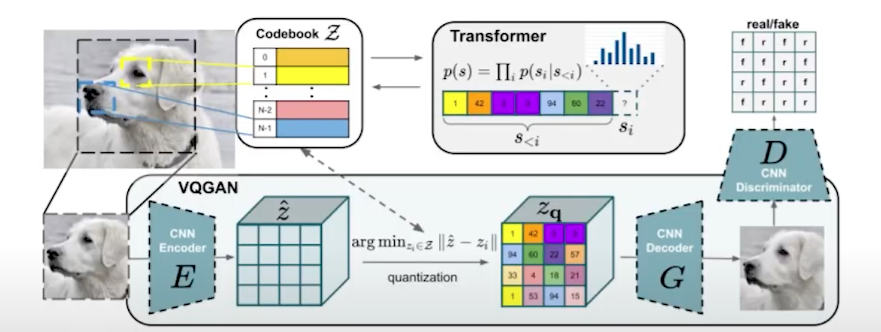

# VQGAN



<code>Vector Quantized Generative Adversarial Networks</code> (VQGAN) is a generative model for image synthesis introduced in Taming Transformers for High-Resolution Image Synthesis. The model operates in two stages.

In the first stage, an autoencoder-like architecture is used: images are encoded into a low-dimensional latent space, where vector quantization is applied using a codebook. The quantized latent vectors are then decoded back into image space using a fully convolutional decoder.

In the second stage, a transformer is trained on the latent representations. It learns patterns and relationships between the codebook vectors, identifying which ones typically appear together. This allows the model to generate new images autoregressively, by predicting plausible sequences of codebook entries based on learned distributions.


## Generated example
After First Stage (Reconstruction):
<!--  -->

After Second Stage (Reconstruction):
<!--  -->


## Citation
```bibtex
@misc{esser2021taming,
      title={Taming Transformers for High-Resolution Image Synthesis}, 
      author={Patrick Esser and Robin Rombach and Björn Ommer},
      year={2021},
      eprint={2012.09841},
      archivePrefix={arXiv},
      primaryClass={cs.CV}
}
```
